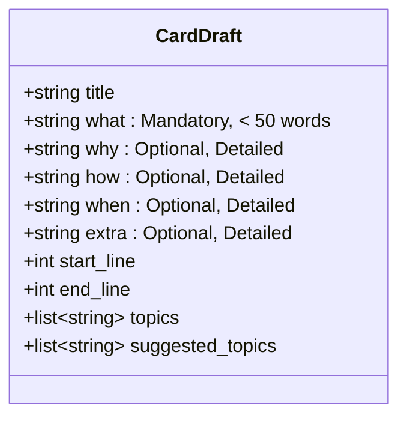
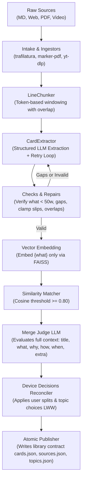

# Reading Helper (CardSmith / Synapse)

> **An AI-powered knowledge synthesis engine and reading companion that transforms long-form text, research papers, web articles, and videos into structured, atomic study cards with vector deduplication, cross-document synthesis, and multi-device synchronization.**

---

## Table of Contents

- [Overview](#overview)
- [Card Anatomy & Design Principles](#card-anatomy--design-principles)
  - [The Mandatory `what` Field](#the-mandatory-what-field)
  - [Deep-Dive Context Fields](#deep-dive-context-fields)
- [Architecture & Pipeline](#architecture--pipeline)
- [Model Testing & Comparison Utility](#model-testing--comparison-utility)
  - [Why Use It?](#why-use-it)
  - [Usage Examples](#usage-examples)
  - [Supported Options & Flags](#supported-options--flags)
- [CLI Reference (`rh`)](#cli-reference-rh)
- [Repository Structure](#repository-structure)
- [Quickstart & Setup](#quickstart--setup)
- [Configuration](#configuration)
- [Testing & Quality Assurance](#testing--quality-assurance)
- [Suggested Project Names](#suggested-project-names)

---

## Overview

Reading Helper solves information overload for serious learners, researchers, and engineers. Instead of leaving highlights and notes scattered across apps, Reading Helper:

1. **Ingests Multi-Format Media:** Markdown documents, web articles (via `trafilatura`), PDF books and research papers (`marker-pdf` / `pymupdf4llm`), and YouTube videos (`yt-dlp` subtitles and chapter TOCs).
2. **Extracts Atomic Study Cards:** Segments source materials into line-referenced chunks and uses structured LLM outputs to extract atomic concepts with strict word count constraints and coverage guarantees.
3. **Embeds Concise Takeaways Only:** Embeds only the concise `< 50` word description (`{what}`), keeping vector representations semantically concentrated and preventing vector pollution.
4. **Merges Across Sources with LLM Adjudication:** Finds semantic duplicates across all read materials using FAISS vector similarity and evaluates candidates using a full-context LLM judge (`title`, `what`, `why`, `how`, `when`, `extra`).
5. **Preserves User Agency:** Syncs bidirectionally with web and mobile readers, respecting manual user splits, custom topic taxonomies, and `never_merge` constraints.

---

## Card Anatomy & Design Principles

Every extracted knowledge card follows a strictly structured schema defined in [`CardDraft`](file:///backend/src/rh_ingest/llm/schemas.py):



### The Mandatory `what` Field
- **Strictly Required:** The LLM is required to output a non-empty `what` description for every single card. Empty or omitted descriptions trigger automatic repair or retry.
- **Word-Count Constrained (`< 50 words`):** The description must be brief, crisp, and high-signal. If `len(words) > checks.max_description_words` (default: 50), validation fails and sends targeted feedback to the LLM.
- **Sharp Vector Embeddings:** Only this brief description is embedded into FAISS. Embedding long cards causes vector dilution; embedding the concise takeaway yields pinpoint semantic matching.

### Deep-Dive Context Fields
While `what` is kept under 50 words, the remaining fields are designed for rich, exhaustive depth:
- **`why`:** Rationale, significance, underlying principles, and motivation.
- **`how`:** Step-by-step mechanism, technical formulation, or implementation details.
- **`when`:** Application scenarios, operational boundaries, prerequisites, or trade-offs.
- **`extra`:** Nuances, edge cases, examples, counterarguments, and additional context.
- **`start_line` .. `end_line`:** Exact 1-based line references mapped back to the source text.

---

## Architecture & Pipeline



- **Crash Resilience:** Every chunk extraction and merge operation is tracked in a SQLite WAL database ([`work.db`](file:///backend/src/rh_ingest/workdb.py)). If the system crashes or restarts, resuming skips completed chunks.
- **Process Safety:** A cross-process lock ([`FileLock`](file:///backend/src/rh_ingest/lock.py)) prevents concurrent writes to the library.

---

## Model Testing & Comparison Utility

When configuring local or cloud LLMs, selecting the right model, temperature, and prompt format is critical. Reading Helper includes an inspection and comparison tool available via the CLI (`rh test-model`) and as a standalone script ([`backend/scripts/test_model.py`](file:///backend/scripts/test_model.py)).

### Why Use It?
- **Verify Card Quality:** See cards formatted in real-time in Rich terminal panels.
- **Enforce Constraints:** Test whether candidate models adhere to the `< 50 words` limit on `what` and generate valid line boundaries.
- **Compare Options:** Test multiple models (e.g. `gpt-4o-mini` vs `gpt-4o` vs local `llama3.2`) and multiple temperatures side-by-side.
- **Inspect Metrics:** Compare latency, token consumption (input/output), card yields, and check statuses in an automatic summary comparison table.
- **Local & Cloud Ready:** Works with OpenAI, Ollama, vLLM, OpenRouter, and LocalAI.

### Usage Examples

```bash
cd backend

# 1. Inspect card extraction on a sample document using default configuration:
uv run rh test-model samples/sample_notes.md
# Or via standalone script:
uv run python scripts/test_model.py samples/sample_notes.md

# 2. Compare two or more models side-by-side:
uv run rh test-model samples/sample_notes.md --models gpt-4o-mini,gpt-4o

# 3. Test multiple temperatures on your model:
uv run rh test-model samples/sample_notes.md -m gpt-4o-mini -t 0.0 -t 0.7

# 4. Test a local Ollama or vLLM instance:
uv run rh test-model samples/sample_notes.md --base-url http://localhost:11434/v1 -m llama3.2

# 5. Inspect a specific line range:
uv run rh test-model samples/sample_notes.md --lines 1:40

# 6. Test raw prompt mode (without structured card schema):
uv run rh test-model samples/sample_notes.md --mode raw

# 7. Export structured evaluation results to JSON:
uv run rh test-model samples/sample_notes.md -o results.json
```

### Supported Options & Flags

| Flag | Short | Default | Description |
| :--- | :--- | :--- | :--- |
| `file` | | *Required* | Path to input Markdown or text file |
| `--model` | `-m` | `cfg.llm.model` | Model name(s) to test (repeatable or comma-separated) |
| `--temperature` | `-t` | `cfg.llm.temperature` | Temperature(s) to test (repeatable or comma-separated) |
| `--mode` | | `cards` | Operation mode: `cards` (structured extraction) or `raw` (direct prompt) |
| `--base-url` | | `cfg.llm.base_url` | Custom LLM API endpoint URL (e.g. `http://localhost:11434/v1`) |
| `--api-key` | | `cfg.llm.api_key` | LLM API key (reads `RH__LLM__API_KEY` or `OPENAI_API_KEY`) |
| `--structured-method` | | `json_schema` | Structured output method: `json_schema`, `function_calling`, `json_mode` |
| `--lines` | | *All lines* | Line range to test (e.g. `1:50`) |
| `--max-desc-words` | | `50` | Maximum allowed words for `what` field |
| `--output` | `-o` | `None` | Path to save complete evaluation metrics to JSON |
| `--json` | | `False` | Output raw JSON to standard output |

---

## CLI Reference (`rh`)

The backend provides the unified `rh` command-line interface:

```bash
# Ingest files or URLs directly:
uv run rh ingest path/to/article.md https://youtu.be/example_video

# Scan inbox/ folder and ingest all new items:
uv run rh ingest --inbox

# Run watch daemon on library/inbox/ and inbox/links.txt:
uv run rh watch

# Test and inspect LLM models on content:
uv run rh test-model samples/sample_notes.md --model gpt-4o-mini

# Re-run extraction and merging for an existing source:
uv run rh rerun s_3a8b2c1d90

# Apply user splits / topic decisions from library/state/ and republish:
uv run rh apply

# Show latest ingest report table:
uv run rh report [optional_sid]

# Validate library schemas and reference ranges:
uv run rh validate [/path/to/library]

# Show status of all jobs in work.db:
uv run rh status

# Launch local deterministic mock model server for development:
uv run rh mock-server --port 8801
```

---

## Repository Structure

```
reading_helper/
├── README.md                   # This root documentation
├── WORKLOG.md                  # Development trajectory and milestone log
├── .gitignore                  # Git ignore rules for build, test, and synced assets
├── backend/                    # Python ingestion engine
│   ├── pyproject.toml          # uv / hatchling package configuration
│   ├── config.example.yaml     # Fully annotated configuration template
│   ├── prompts/                # Card extraction, retry, and merge prompt templates
│   │   ├── cards.md            # Chunk card extraction prompt
│   │   ├── cards_retry.md      # Gap and validation feedback retry prompt
│   │   └── merge.md            # Adjudication merge judge prompt
│   ├── samples/                # Sample files for inspection and testing
│   │   └── sample_notes.md     # Transformer attention notes test fixture
│   ├── scripts/                # Standalone utilities
│   │   └── test_model.py       # Standalone model inspection script
│   ├── src/rh_ingest/          # Core Python package
│   │   ├── cli.py              # Typer CLI application (rh)
│   │   ├── config.py           # Pydantic Settings and YAML loader
│   │   ├── inspect.py          # Model evaluation and comparison engine
│   │   ├── pipeline.py         # Ingestion orchestration
│   │   ├── cards.py            # Card models and overlap matching
│   │   ├── chunk.py            # Token-based chunker
│   │   ├── decisions.py        # User device state reconciler
│   │   ├── topics.py           # Topic hierarchy tree
│   │   ├── workdb.py           # SQLite WAL state database
│   │   ├── extract/            # CardExtractor and validation checks
│   │   ├── ingest/             # Markdown, Blog, PDF, and Video ingestors
│   │   ├── llm/                # LangChain OpenAI wrapper and schemas
│   │   └── mock/               # Deterministic local mock server
│   └── tests/                  # 57 unit, integration, and contract tests
├── packages/
│   └── core/                   # Shared TypeScript library contract & schemas
├── apps/
│   ├── web/                    # Web reading client (Svelte / Vite)
│   └── mobile/                 # Mobile reading client (Capacitor / Ionic / Svelte)
└── docs/                       # Technical specs, design decisions, and research
```

---

## Quickstart & Setup

### Prerequisites
- Python 3.12+
- [`uv`](https://docs.astral.sh/uv/) for fast Python package management
- Node.js 20+ (for `web` and `mobile` apps)

### 1. Installation

```bash
# Clone the repository
git clone <repo-url> reading_helper
cd reading_helper/backend

# Create virtual environment and sync dependencies
uv sync
```

### 2. Configure Settings

Copy the example configuration to your local config folder:

```bash
mkdir -p ~/.config/reading-helper
cp config.example.yaml ~/.config/reading-helper/config.yaml
```

Set your OpenAI API key or configure your local server endpoint:

```bash
export OPENAI_API_KEY="sk-..."
# Or configure via environment variable override:
export RH__LLM__BASE_URL="http://localhost:11434/v1"
export RH__LLM__MODEL="llama3.2"
```

---

## Configuration

Settings are resolved with the following priority:
1. Environment variables with prefix `RH__<SECTION>__<KEY>` (e.g. `RH__LLM__API_KEY=sk-...`)
2. File specified by `--config` / `-c` or `RH_CONFIG`
3. Default user configuration at `~/.config/reading-helper/config.yaml`
4. Built-in defaults

Key configuration parameters ([`config.example.yaml`](file:///backend/config.example.yaml)):

```yaml
library_dir: "/data/Sync/library"           # Synced library folder read by web/mobile
work_dir: "/data/reading-helper-work"        # Private local cache: work.db, FAISS index, downloads

llm:
  base_url: "http://127.0.0.1:8801/v1"       # Dev mock server or real LLM endpoint
  api_key: "dev"
  model: "qwen-2.5-72b-instruct"
  temperature: 0.2
  structured_method: "json_schema"          # json_schema | function_calling | json_mode

embeddings:
  base_url: "http://127.0.0.1:8801/v1"
  model: "text-embedding-3-small"
  text: "{what}"                            # Embed only the brief description

checks:
  max_description_words: 50                 # Mandatory what description limit (< 50 words)
  max_gap_lines: 20                         # Max uncovered lines allowed before retry
  max_retries: 3                            # LLM retry attempts per chunk

merge:
  threshold: 0.80                           # Cosine similarity threshold for candidate pairing
  overlap_always_judge: true                # Always judge cards sharing source lines
```

---

## Testing & Quality Assurance

All unit and integration tests are 100% deterministic, require zero GPU, and execute completely offline using the built-in mock server fixture:

```bash
cd backend

# Run the full test suite (57 tests)
uv run pytest

# Check code quality and formatting
uv run ruff check .
uv run ruff format --check .
```

---

## Suggested Project Names

As the project evolves beyond its initial working title (`reading_helper`), here are recommended project names reflecting its unique architecture:

| Name | Theme | Rationale |
| :--- | :--- | :--- |
| **CardSmith** | Craftsmanship | Conveys the precision of forging atomic, high-quality knowledge cards from raw materials. |
| **SynapseRead** / **Synapse** | Neural / Network | Highlights how embeddings and merge logic form a connected web of ideas across books, articles, and talks. |
| **ReadWeave** | Synthesis | Emphasizes the intertwining of multiple source perspectives into single canonical cards. |
| **Episteme** | Philosophy / Knowledge | From the Greek *epistêmê* (structured understanding and scientific knowledge). |
| **Marginalia** | Literary / Scholarly | Celebrates the timeless practice of marginal annotations, supercharged with modern AI. |
| **Atomize** / **AtomRead** | Architecture | Directly mirrors the core technical design: atomizing long texts into concise `< 50w` takeaways with deep context. |
