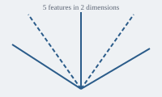

# Interpretability Notes

An example book for the reading helper fixture.

Preface supporting text, sentence 1.
Preface supporting text, sentence 2.
Preface supporting text, sentence 3.
Preface supporting text, sentence 4.
Preface supporting text, sentence 5.

Preface supporting text, sentence 7.
Preface supporting text, sentence 8.
Preface supporting text, sentence 9.
Preface supporting text, sentence 10.
Preface supporting text, sentence 11.

Preface supporting text, sentence 13.
Preface supporting text, sentence 14.
Preface supporting text, sentence 15.
Preface supporting text, sentence 16.
Preface supporting text, sentence 17.

Preface supporting text, sentence 19.
Preface supporting text, sentence 20.
Preface supporting text, sentence 21.
Preface supporting text, sentence 22.
Preface supporting text, sentence 23.

Preface supporting text, sentence 25.
Preface supporting text, sentence 26.
Preface supporting text, sentence 27.
Preface supporting text, sentence 28.
Preface supporting text, sentence 29.

## 3 · Probing

Probing supporting text, sentence 1.
Probing supporting text, sentence 2.
Probing supporting text, sentence 3.
Probing supporting text, sentence 4.
Probing supporting text, sentence 5.

Probing supporting text, sentence 7.
Probing supporting text, sentence 8.
Probing supporting text, sentence 9.
Probing supporting text, sentence 10.
A probe is a small linear classifier trained on activations.
If it predicts the label well, the information is present.
We train one probe per layer and compare the scores.
Probing supporting text, sentence 1.
Probing supporting text, sentence 2.
Probing supporting text, sentence 3.
Probing supporting text, sentence 4.
Probing supporting text, sentence 5.

Probing supporting text, sentence 7.
Probing supporting text, sentence 8.
Probing supporting text, sentence 9.
Probing supporting text, sentence 10.
Probing supporting text, sentence 11.

Probing supporting text, sentence 13.
Probing supporting text, sentence 14.
Probing supporting text, sentence 15.
Probing supporting text, sentence 16.
Probing supporting text, sentence 17.

Probing supporting text, sentence 19.
Probing supporting text, sentence 20.
Probing supporting text, sentence 21.
Probing supporting text, sentence 22.
Probing supporting text, sentence 23.

Probing supporting text, sentence 25.
Probing supporting text, sentence 26.
Probing supporting text, sentence 27.
Probing supporting text, sentence 28.
Probing supporting text, sentence 29.

Probing supporting text, sentence 31.
Probing supporting text, sentence 32.
Probing supporting text, sentence 33.
Probing supporting text, sentence 34.
Probing supporting text, sentence 35.

Probing supporting text, sentence 37.
Probing supporting text, sentence 38.
Probing supporting text, sentence 39.
Probing supporting text, sentence 40.
Probing supporting text, sentence 1.
Probing supporting text, sentence 2.
Probing supporting text, sentence 3.
Probing supporting text, sentence 4.
Probing supporting text, sentence 5.

Probing supporting text, sentence 7.
Probing supporting text, sentence 8.
High probe accuracy does not mean the model uses the feature.
The probe may learn the task by itself from rich activations.
We need a causal test as well.
Probing supporting text, sentence 1.
Probing supporting text, sentence 2.
Probing supporting text, sentence 3.
Probing supporting text, sentence 4.
Probing supporting text, sentence 5.

Probing supporting text, sentence 7.
Probing supporting text, sentence 8.
Probing supporting text, sentence 9.
Probing supporting text, sentence 10.
Probing supporting text, sentence 11.

Probing supporting text, sentence 13.
Probing supporting text, sentence 14.
Probing supporting text, sentence 15.
Probing supporting text, sentence 16.
Probing supporting text, sentence 17.

Probing supporting text, sentence 19.
Probing supporting text, sentence 20.
Probing supporting text, sentence 21.
Probing supporting text, sentence 22.
Probing supporting text, sentence 23.

Probing supporting text, sentence 25.
Probing supporting text, sentence 26.
Probing supporting text, sentence 27.
Probing supporting text, sentence 28.
Probing supporting text, sentence 29.

Probing supporting text, sentence 31.
Probing supporting text, sentence 32.
Probing supporting text, sentence 33.
Probing supporting text, sentence 34.
Probing supporting text, sentence 35.

Probing supporting text, sentence 37.
Probing supporting text, sentence 38.
Probing supporting text, sentence 39.
Probing supporting text, sentence 40.
Probing supporting text, sentence 41.

Probing supporting text, sentence 43.
Probing supporting text, sentence 44.
Probing supporting text, sentence 45.
Probing supporting text, sentence 46.
Probing supporting text, sentence 47.

Probing supporting text, sentence 49.
Probing supporting text, sentence 50.
Probing supporting text, sentence 51.
Probing supporting text, sentence 52.
Probing supporting text, sentence 53.

Probing supporting text, sentence 55.
Probing supporting text, sentence 56.
Probing supporting text, sentence 57.
Probing supporting text, sentence 58.
Probing supporting text, sentence 59.

Transition supporting text, sentence 1.
Transition supporting text, sentence 2.
Transition supporting text, sentence 3.
Transition supporting text, sentence 4.
Transition supporting text, sentence 5.
## 4 · Features

Features supporting text, sentence 1.
Features supporting text, sentence 2.
Features supporting text, sentence 3.
Features supporting text, sentence 4.
A layer with $n$ neurons can still hold more than $n$ features,
if each feature is sparse. Each feature is a direction
in activation space, not a single neuron (see Figure 3).
Features supporting text, sentence 1.
Features supporting text, sentence 2.
Features supporting text, sentence 3.
Features supporting text, sentence 4.
Features supporting text, sentence 5.

Features supporting text, sentence 1.
Features supporting text, sentence 2.
Because directions overlap, one neuron takes part in many features.
Its top examples then look like a mix of unrelated things.
Features supporting text, sentence 1.
Features supporting text, sentence 2.
Features supporting text, sentence 3.
Features supporting text, sentence 4.
Features supporting text, sentence 5.

Features supporting text, sentence 7.
Features supporting text, sentence 8.
Features supporting text, sentence 9.
Features supporting text, sentence 10.
Features supporting text, sentence 11.

Features supporting text, sentence 1.
Features supporting text, sentence 2.
Features supporting text, sentence 3.
Features supporting text, sentence 4.
Features supporting text, sentence 5.

To pull the features apart, train a sparse autoencoder on the activations.
Its hidden layer is wider than the input,
and an L1 penalty keeps most units off:
$$\mathcal{L} = \|x - \hat{x}\|_2^2 + \lambda \|h\|_1$$
Features supporting text, sentence 1.
Features supporting text, sentence 2.
Features supporting text, sentence 3.
Features supporting text, sentence 4.
Features supporting text, sentence 5.

Features supporting text, sentence 7.
Features supporting text, sentence 8.
Features supporting text, sentence 9.
Features supporting text, sentence 10.
Features supporting text, sentence 11.

Features supporting text, sentence 13.
Features supporting text, sentence 14.
Features supporting text, sentence 15.
Features supporting text, sentence 16.
Features supporting text, sentence 17.

Features supporting text, sentence 19.
Features supporting text, sentence 20.
Features supporting text, sentence 21.
Features supporting text, sentence 22.
Features supporting text, sentence 23.

Features supporting text, sentence 25.
Features supporting text, sentence 26.
Features supporting text, sentence 27.
Features supporting text, sentence 28.
Features supporting text, sentence 29.

Features supporting text, sentence 31.
Features supporting text, sentence 32.
Features supporting text, sentence 33.
Features supporting text, sentence 34.
Features supporting text, sentence 35.

Features supporting text, sentence 37.
Features supporting text, sentence 38.
Features supporting text, sentence 39.
Features supporting text, sentence 40.
Features supporting text, sentence 41.

Features supporting text, sentence 43.
Features supporting text, sentence 44.
Features supporting text, sentence 45.
Features supporting text, sentence 46.
Features supporting text, sentence 47.

Features supporting text, sentence 49.
Features supporting text, sentence 50.
Features supporting text, sentence 51.
Features supporting text, sentence 52.
Features supporting text, sentence 53.

Features supporting text, sentence 55.
Features supporting text, sentence 56.
Features supporting text, sentence 57.
Features supporting text, sentence 58.
Features supporting text, sentence 59.

Features supporting text, sentence 61.
Features supporting text, sentence 62.
Features supporting text, sentence 63.
Features supporting text, sentence 64.
Features supporting text, sentence 65.

Features supporting text, sentence 67.
Features supporting text, sentence 68.
Features supporting text, sentence 69.
Features supporting text, sentence 70.
Features supporting text, sentence 1.
Features supporting text, sentence 2.
Features supporting text, sentence 3.
Some units in the autoencoder never activate.
We call them dead features and resample them during training.
Features supporting text, sentence 1.
Features supporting text, sentence 2.
Features supporting text, sentence 3.
Features supporting text, sentence 4.
Features supporting text, sentence 5.

Features supporting text, sentence 7.
Features supporting text, sentence 8.
Features supporting text, sentence 9.
Features supporting text, sentence 10.
Features supporting text, sentence 11.

Features supporting text, sentence 13.
Features supporting text, sentence 14.
Features supporting text, sentence 15.
Features supporting text, sentence 16.
Features supporting text, sentence 17.

Features supporting text, sentence 19.
Features supporting text, sentence 20.
Summary supporting text, sentence 1.
Summary supporting text, sentence 2.
Summary supporting text, sentence 3.
Summary supporting text, sentence 4.
Summary supporting text, sentence 5.

Summary supporting text, sentence 7.
Summary supporting text, sentence 8.
Summary supporting text, sentence 9.
Summary supporting text, sentence 10.
## 5 · Circuits

Circuits supporting text, sentence 1.
Circuits supporting text, sentence 2.
Circuits supporting text, sentence 3.
Circuits supporting text, sentence 4.
Circuits supporting text, sentence 5.

Circuits supporting text, sentence 7.
Circuits supporting text, sentence 8.
Circuits supporting text, sentence 9.
Circuits supporting text, sentence 10.
A circuit is a subgraph of the model: a few heads and neurons
connected by weights, that together compute one behaviour.
Circuits supporting text, sentence 1.
Circuits supporting text, sentence 2.
Circuits supporting text, sentence 3.
Circuits supporting text, sentence 4.
Circuits supporting text, sentence 5.

Circuits supporting text, sentence 7.
Circuits supporting text, sentence 8.
Circuits supporting text, sentence 9.
Circuits supporting text, sentence 10.
Circuits supporting text, sentence 11.

Circuits supporting text, sentence 13.
Circuits supporting text, sentence 14.
Circuits supporting text, sentence 15.
Circuits supporting text, sentence 16.
Circuits supporting text, sentence 17.

Circuits supporting text, sentence 19.
Circuits supporting text, sentence 20.
Circuits supporting text, sentence 21.
Circuits supporting text, sentence 22.
Circuits supporting text, sentence 23.

Circuits supporting text, sentence 25.
Circuits supporting text, sentence 26.
Circuits supporting text, sentence 27.
Circuits supporting text, sentence 28.
Circuits supporting text, sentence 29.

Circuits supporting text, sentence 31.
Circuits supporting text, sentence 32.
Circuits supporting text, sentence 33.
Circuits supporting text, sentence 34.
Circuits supporting text, sentence 35.

Circuits supporting text, sentence 37.
Circuits supporting text, sentence 38.
Circuits supporting text, sentence 39.
Circuits supporting text, sentence 40.
Circuits supporting text, sentence 41.

Circuits supporting text, sentence 43.
Circuits supporting text, sentence 44.
Circuits supporting text, sentence 45.
Circuits supporting text, sentence 46.
Circuits supporting text, sentence 47.

Circuits supporting text, sentence 49.
Circuits supporting text, sentence 50.
Circuits supporting text, sentence 51.
Circuits supporting text, sentence 52.
Circuits supporting text, sentence 53.

Circuits supporting text, sentence 55.
Circuits supporting text, sentence 56.
Circuits supporting text, sentence 57.
Circuits supporting text, sentence 58.
Circuits supporting text, sentence 59.

Circuits supporting text, sentence 61.
Circuits supporting text, sentence 62.
Circuits supporting text, sentence 63.
Circuits supporting text, sentence 64.
Circuits supporting text, sentence 65.

Circuits supporting text, sentence 67.
Circuits supporting text, sentence 68.
Circuits supporting text, sentence 69.
Circuits supporting text, sentence 70.
Circuits supporting text, sentence 71.

Circuits supporting text, sentence 73.
Circuits supporting text, sentence 74.
Circuits supporting text, sentence 75.
Circuits supporting text, sentence 76.
Circuits supporting text, sentence 77.

Circuits supporting text, sentence 79.
Circuits supporting text, sentence 80.
Circuits supporting text, sentence 81.
Circuits supporting text, sentence 82.
Circuits supporting text, sentence 83.

Circuits supporting text, sentence 85.
Circuits supporting text, sentence 86.
Circuits supporting text, sentence 87.
Circuits supporting text, sentence 88.
Circuits supporting text, sentence 89.

Circuits supporting text, sentence 1.
Circuits supporting text, sentence 2.
Circuits supporting text, sentence 3.
Circuits supporting text, sentence 4.
Circuits supporting text, sentence 5.

An induction head looks back for the previous copy of the current token
and attends to the token after it, then copies it forward.
Circuits supporting text, sentence 1.
Circuits supporting text, sentence 2.
Circuits supporting text, sentence 3.
Circuits supporting text, sentence 4.
Circuits supporting text, sentence 5.

Circuits supporting text, sentence 7.
Circuits supporting text, sentence 8.
Circuits supporting text, sentence 9.
Circuits supporting text, sentence 10.
Circuits supporting text, sentence 11.

Circuits supporting text, sentence 13.
Circuits supporting text, sentence 14.
Circuits supporting text, sentence 15.
Circuits supporting text, sentence 16.
Circuits supporting text, sentence 17.

Circuits supporting text, sentence 19.
Circuits supporting text, sentence 20.
Circuits supporting text, sentence 21.
Circuits supporting text, sentence 22.
Circuits supporting text, sentence 23.

Circuits supporting text, sentence 25.
Circuits supporting text, sentence 26.
Circuits supporting text, sentence 27.
Circuits supporting text, sentence 28.
Circuits supporting text, sentence 29.

Circuits supporting text, sentence 31.
Circuits supporting text, sentence 32.
Circuits supporting text, sentence 33.
Circuits supporting text, sentence 34.
Circuits supporting text, sentence 35.

Circuits supporting text, sentence 37.
Circuits supporting text, sentence 38.
Circuits supporting text, sentence 39.
Circuits supporting text, sentence 40.
Circuits supporting text, sentence 41.

Circuits supporting text, sentence 43.
Circuits supporting text, sentence 44.
Circuits supporting text, sentence 45.
Aside supporting text, sentence 1.
Aside supporting text, sentence 2.
Aside supporting text, sentence 3.
Aside supporting text, sentence 4.
Aside supporting text, sentence 5.

Aside supporting text, sentence 7.
Aside supporting text, sentence 8.
Aside supporting text, sentence 9.
Aside supporting text, sentence 10.
Aside supporting text, sentence 11.

Aside supporting text, sentence 13.
Aside supporting text, sentence 14.
Aside supporting text, sentence 15.
Aside supporting text, sentence 16.
Aside supporting text, sentence 17.

Aside supporting text, sentence 19.
Aside supporting text, sentence 20.
Aside supporting text, sentence 21.
Aside supporting text, sentence 22.
Aside supporting text, sentence 23.

Aside supporting text, sentence 25.
Aside supporting text, sentence 26.
Aside supporting text, sentence 27.
Aside supporting text, sentence 28.
Aside supporting text, sentence 29.

Aside supporting text, sentence 31.
Aside supporting text, sentence 32.
Aside supporting text, sentence 33.
Aside supporting text, sentence 34.
Aside supporting text, sentence 35.

Aside supporting text, sentence 37.
Aside supporting text, sentence 38.
Aside supporting text, sentence 39.
Circuits supporting text, sentence 1.
Circuits supporting text, sentence 2.
Circuits supporting text, sentence 3.
Circuits supporting text, sentence 4.
Circuits supporting text, sentence 5.
Run the model on a clean and a corrupted input.
Copy one activation from the clean run into the corrupted run.
If the output recovers, that activation matters.
Circuits supporting text, sentence 1.
Circuits supporting text, sentence 2.
Circuits supporting text, sentence 3.
Circuits supporting text, sentence 4.
Circuits supporting text, sentence 5.

Circuits supporting text, sentence 7.
Circuits supporting text, sentence 8.
Circuits supporting text, sentence 9.
Circuits supporting text, sentence 10.
Circuits supporting text, sentence 11.

Circuits supporting text, sentence 13.
Circuits supporting text, sentence 14.
Circuits supporting text, sentence 15.
Circuits supporting text, sentence 16.
Circuits supporting text, sentence 17.

Circuits supporting text, sentence 19.
Circuits supporting text, sentence 20.
Circuits supporting text, sentence 21.
Circuits supporting text, sentence 22.
Circuits supporting text, sentence 23.

Circuits supporting text, sentence 25.
Circuits supporting text, sentence 26.
Circuits supporting text, sentence 27.
Circuits supporting text, sentence 28.
Circuits supporting text, sentence 29.

Circuits supporting text, sentence 31.
Circuits supporting text, sentence 32.
Circuits supporting text, sentence 33.
Circuits supporting text, sentence 34.
Circuits supporting text, sentence 35.

Circuits supporting text, sentence 37.
Circuits supporting text, sentence 38.
Circuits supporting text, sentence 39.
Circuits supporting text, sentence 40.
End supporting text, sentence 1.
End supporting text, sentence 2.
End supporting text, sentence 3.
