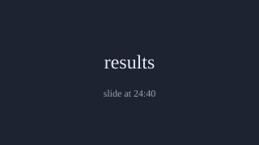
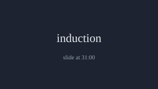

# Talk: looking inside LLMs

## Attention
[0:00] (talking about the topic at 0:00)
[0:10] (talking about the topic at 0:10)
[0:20] (talking about the topic at 0:20)
[0:30] (talking about the topic at 0:30)
[0:40] (talking about the topic at 0:40)
[0:50] (talking about the topic at 0:50)
[1:00] (talking about the topic at 1:00)
[1:10] (talking about the topic at 1:10)
[1:20] (talking about the topic at 1:20)
[1:30] (talking about the topic at 1:30)
[1:40] (talking about the topic at 1:40)
[1:50] (talking about the topic at 1:50)
[2:00] (talking about the topic at 2:00)

[2:10] Think of attention as a soft lookup table.
[2:20] Each query compares itself with every key.
[2:30] The output is a weighted mix of the values.
[2:40] (talking about the topic at 2:40)
[2:50] (talking about the topic at 2:50)
[3:00] (talking about the topic at 3:00)
[3:10] (talking about the topic at 3:10)
[3:20] (talking about the topic at 3:20)
[3:30] (talking about the topic at 3:30)
[3:40] (talking about the topic at 3:40)
[3:50] (talking about the topic at 3:50)
[4:00] (talking about the topic at 4:00)
[4:10] (talking about the topic at 4:10)
[4:20] (talking about the topic at 4:20)
[4:30] (talking about the topic at 4:30)
[4:40] (talking about the topic at 4:40)
[4:50] (talking about the topic at 4:50)
[5:00] (talking about the topic at 5:00)
[5:10] (talking about the topic at 5:10)
[5:20] (talking about the topic at 5:20)
[5:30] (talking about the topic at 5:30)
[5:40] (talking about the topic at 5:40)
[5:50] (talking about the topic at 5:50)
[6:00] (talking about the topic at 6:00)
[6:10] (talking about the topic at 6:10)
[6:20] (talking about the topic at 6:20)
[6:30] (talking about the topic at 6:30)
[6:40] (talking about the topic at 6:40)
[6:50] (talking about the topic at 6:50)
[7:00] (talking about the topic at 7:00)
[7:10] (talking about the topic at 7:10)
[7:20] (talking about the topic at 7:20)
[7:30] (talking about the topic at 7:30)
[7:40] (talking about the topic at 7:40)
[7:50] (talking about the topic at 7:50)
[8:00] (talking about the topic at 8:00)
[8:10] (talking about the topic at 8:10)
[8:20] (talking about the topic at 8:20)
[8:30] (talking about the topic at 8:30)
[8:40] (talking about the topic at 8:40)
[8:50] (talking about the topic at 8:50)
[9:00] (talking about the topic at 9:00)
[9:10] (talking about the topic at 9:10)
[9:20] (talking about the topic at 9:20)
[9:30] (talking about the topic at 9:30)
[9:40] (talking about the topic at 9:40)
[9:50] (talking about the topic at 9:50)
[10:00] (talking about the topic at 10:00)
[10:10] (talking about the topic at 10:10)
[10:20] (talking about the topic at 10:20)
[10:30] (talking about the topic at 10:30)
[10:40] (talking about the topic at 10:40)
[10:50] (talking about the topic at 10:50)
[11:00] (talking about the topic at 11:00)
[11:10] (talking about the topic at 11:10)
[11:20] (talking about the topic at 11:20)
[11:30] (talking about the topic at 11:30)
## Features
[11:40] (talking about the topic at 11:40)
[11:50] (talking about the topic at 11:50)
[12:00] (talking about the topic at 12:00)
[12:10] (talking about the topic at 12:10)
[12:20] (talking about the topic at 12:20)

[12:30] A layer with $n$ neurons can still hold more than $n$ features,
[12:40] if each feature is sparse. Each feature is a direction
[12:50] in activation space, not a single neuron (see Figure 3).
[13:00] (talking about the topic at 13:00)
[13:10] (talking about the topic at 13:10)
[13:20] (talking about the topic at 13:20)
[13:30] (talking about the topic at 13:30)
[13:40] (talking about the topic at 13:40)
[13:50] (talking about the topic at 13:50)
[14:00] (talking about the topic at 14:00)
[14:10] (talking about the topic at 14:10)
[14:20] (talking about the topic at 14:20)
[14:30] (talking about the topic at 14:30)
[14:40] (talking about the topic at 14:40)
[14:50] (talking about the topic at 14:50)
[15:00] (talking about the topic at 15:00)
[15:10] (talking about the topic at 15:10)
[15:20] (talking about the topic at 15:20)
[15:30] (talking about the topic at 15:30)
[15:40] (talking about the topic at 15:40)
[15:50] (talking about the topic at 15:50)
[16:00] (talking about the topic at 16:00)
[16:10] (talking about the topic at 16:10)
[16:20] (talking about the topic at 16:20)
[16:30] (talking about the topic at 16:30)
[16:40] (talking about the topic at 16:40)
[16:50] (talking about the topic at 16:50)
[17:00] (talking about the topic at 17:00)
[17:10] (talking about the topic at 17:10)
[17:20] (talking about the topic at 17:20)
[17:30] (talking about the topic at 17:30)
[17:40] (talking about the topic at 17:40)
[17:50] (talking about the topic at 17:50)

[18:00] To pull the features apart, train a sparse autoencoder on the activations.
[18:10] Its hidden layer is wider than the input,
[18:20] and an L1 penalty keeps most units off:
[18:30] $$\mathcal{L} = \|x - \hat{x}\|_2^2 + \lambda \|h\|_1$$
[18:40] (talking about the topic at 18:40)
[18:50] (talking about the topic at 18:50)
[19:00] (talking about the topic at 19:00)
[19:10] (talking about the topic at 19:10)
[19:20] (talking about the topic at 19:20)
[19:30] (talking about the topic at 19:30)
[19:40] (talking about the topic at 19:40)
[19:50] (talking about the topic at 19:50)
[20:00] (talking about the topic at 20:00)
[20:10] (talking about the topic at 20:10)
[20:20] (talking about the topic at 20:20)
[20:30] (talking about the topic at 20:30)
[20:40] (talking about the topic at 20:40)
[20:50] (talking about the topic at 20:50)
[21:00] (talking about the topic at 21:00)
[21:10] (talking about the topic at 21:10)
[21:20] (talking about the topic at 21:20)
[21:30] (talking about the topic at 21:30)
[21:40] (talking about the topic at 21:40)
[21:50] (talking about the topic at 21:50)
[22:00] (talking about the topic at 22:00)
[22:10] (talking about the topic at 22:10)
[22:20] (talking about the topic at 22:20)
[22:30] (talking about the topic at 22:30)
[22:40] (talking about the topic at 22:40)
[22:50] (talking about the topic at 22:50)
[23:00] (talking about the topic at 23:00)
[23:10] (talking about the topic at 23:10)
[23:20] (talking about the topic at 23:20)
[23:30] (talking about the topic at 23:30)
[23:40] (talking about the topic at 23:40)
[23:50] (talking about the topic at 23:50)
[24:00] (talking about the topic at 24:00)
[24:10] (talking about the topic at 24:10)
[24:20] (talking about the topic at 24:20)
[24:30] (talking about the topic at 24:30)

[24:40] (talking about the topic at 24:40)
[24:50] (talking about the topic at 24:50)
[25:00] (talking about the topic at 25:00)
[25:10] (talking about the topic at 25:10)
[25:20] (talking about the topic at 25:20)
[25:30] (talking about the topic at 25:30)
[25:40] (talking about the topic at 25:40)
[25:50] (talking about the topic at 25:50)
[26:00] (talking about the topic at 26:00)
[26:10] (talking about the topic at 26:10)
[26:20] (talking about the topic at 26:20)
[26:30] (talking about the topic at 26:30)
[26:40] (talking about the topic at 26:40)
[26:50] (talking about the topic at 26:50)
[27:00] (talking about the topic at 27:00)
[27:10] (talking about the topic at 27:10)
[27:20] (talking about the topic at 27:20)
[27:30] (talking about the topic at 27:30)
[27:40] (talking about the topic at 27:40)
[27:50] (talking about the topic at 27:50)
[28:00] (talking about the topic at 28:00)
[28:10] (talking about the topic at 28:10)
[28:20] (talking about the topic at 28:20)
[28:30] (talking about the topic at 28:30)
[28:40] (talking about the topic at 28:40)
[28:50] (talking about the topic at 28:50)
[29:00] (talking about the topic at 29:00)
[29:10] (talking about the topic at 29:10)
[29:20] (talking about the topic at 29:20)
[29:30] (talking about the topic at 29:30)
[29:40] (talking about the topic at 29:40)
[29:50] (talking about the topic at 29:50)
## Circuits
[30:00] (talking about the topic at 30:00)
[30:10] (talking about the topic at 30:10)
[30:20] (talking about the topic at 30:20)
[30:30] (talking about the topic at 30:30)
[30:40] (talking about the topic at 30:40)
[30:50] (talking about the topic at 30:50)

[31:00] An induction head looks back for the previous copy of the current token
[31:10] and attends to the token after it, then copies it forward.
[31:20] (talking about the topic at 31:20)
[31:30] (talking about the topic at 31:30)
[31:40] (talking about the topic at 31:40)
[31:50] (talking about the topic at 31:50)
[32:00] (talking about the topic at 32:00)
[32:10] (talking about the topic at 32:10)
[32:20] (talking about the topic at 32:20)
[32:30] (talking about the topic at 32:30)
[32:40] (talking about the topic at 32:40)
[32:50] (talking about the topic at 32:50)
[33:00] (talking about the topic at 33:00)
[33:10] (talking about the topic at 33:10)
[33:20] (talking about the topic at 33:20)
[33:30] (talking about the topic at 33:30)
[33:40] (talking about the topic at 33:40)
[33:50] (talking about the topic at 33:50)
[34:00] (talking about the topic at 34:00)
[34:10] (talking about the topic at 34:10)
[34:20] (talking about the topic at 34:20)
[34:30] (talking about the topic at 34:30)
[34:40] (talking about the topic at 34:40)
[34:50] (talking about the topic at 34:50)
[35:00] (talking about the topic at 35:00)
[35:10] (talking about the topic at 35:10)
[35:20] (talking about the topic at 35:20)
[35:30] (talking about the topic at 35:30)
[35:40] (talking about the topic at 35:40)
[35:50] (talking about the topic at 35:50)
[36:00] (talking about the topic at 36:00)
[36:10] (talking about the topic at 36:10)
[36:20] (talking about the topic at 36:20)
[36:30] (talking about the topic at 36:30)
[36:40] (talking about the topic at 36:40)
[36:50] (talking about the topic at 36:50)
[37:00] (talking about the topic at 37:00)
[37:10] (talking about the topic at 37:10)
[37:20] (talking about the topic at 37:20)
[37:30] (talking about the topic at 37:30)
[37:40] (talking about the topic at 37:40)
[37:50] (talking about the topic at 37:50)
[38:00] (talking about the topic at 38:00)
[38:10] (talking about the topic at 38:10)
[38:20] (talking about the topic at 38:20)
[38:30] (talking about the topic at 38:30)
[38:40] (talking about the topic at 38:40)
[38:50] (talking about the topic at 38:50)
[39:00] (talking about the topic at 39:00)
[39:10] (talking about the topic at 39:10)
[39:20] (talking about the topic at 39:20)
[39:30] (talking about the topic at 39:30)
## Questions
[39:40] (talking about the topic at 39:40)
[39:50] (talking about the topic at 39:50)

[40:00] (talking about the topic at 40:00)
[40:10] (talking about the topic at 40:10)
[40:20] (talking about the topic at 40:20)
[40:30] (talking about the topic at 40:30)
[40:40] (talking about the topic at 40:40)
[40:50] (talking about the topic at 40:50)
[41:00] (talking about the topic at 41:00)
[41:10] (talking about the topic at 41:10)
[41:20] (talking about the topic at 41:20)
[41:30] (talking about the topic at 41:30)
[41:40] (talking about the topic at 41:40)
[41:50] (talking about the topic at 41:50)
[42:00] (talking about the topic at 42:00)
[42:10] (talking about the topic at 42:10)
[42:20] (talking about the topic at 42:20)
[42:30] (talking about the topic at 42:30)
[42:40] (talking about the topic at 42:40)
[42:50] (talking about the topic at 42:50)
[43:00] (talking about the topic at 43:00)
[43:10] (talking about the topic at 43:10)
[43:20] (talking about the topic at 43:20)
[43:30] (talking about the topic at 43:30)
[43:40] (talking about the topic at 43:40)
[43:50] (talking about the topic at 43:50)
[44:00] (talking about the topic at 44:00)
[44:10] (talking about the topic at 44:10)
[44:20] (talking about the topic at 44:20)
[44:30] (talking about the topic at 44:30)
[44:40] (talking about the topic at 44:40)
[44:50] (talking about the topic at 44:50)
[45:00] (talking about the topic at 45:00)
[45:10] (talking about the topic at 45:10)
[45:20] (talking about the topic at 45:20)
[45:30] (talking about the topic at 45:30)
[45:40] (talking about the topic at 45:40)
[45:50] (talking about the topic at 45:50)
[46:00] (talking about the topic at 46:00)
[46:10] (talking about the topic at 46:10)
[46:20] (talking about the topic at 46:20)
[46:30] (talking about the topic at 46:30)
[46:40] (talking about the topic at 46:40)
[46:50] (talking about the topic at 46:50)
[47:00] (talking about the topic at 47:00)
[47:10] (talking about the topic at 47:10)
[47:20] (talking about the topic at 47:20)
[47:30] (talking about the topic at 47:30)
[47:40] (talking about the topic at 47:40)
[47:50] (talking about the topic at 47:50)
[48:00] (talking about the topic at 48:00)
